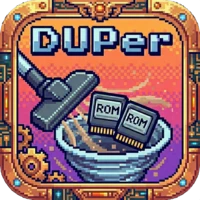

<p align="center">
  
</p>

<h3 align="center">DUPer - ROM Collection Manager</h3>

<p align="center">
  <em>The complete retro gaming infrastructure platform — duplicate detection, smart transfers, media scraping, achievement tracking, acquisition, and multi-device management with a full web UI and TUI</em>
</p>

<p align="center">
  <a href="#quick-start">Quick Start</a> &bull;
  <a href="#features">Features</a> &bull;
  <a href="#web-ui">Web UI</a> &bull;
  <a href="#tui">TUI</a> &bull;
  <a href="#api-reference">API</a> &bull;
  <a href="#scripts">Scripts</a> &bull;
  <a href="#license">License</a>
</p>

<p align="center">
  
  
  
  
</p>

<p align="center">
  
  
  
  
</p>

<p align="center">
  
  
</p>

---

## Table of Contents

<details>
<summary>Click to expand</summary>

- [Quick Start](#quick-start)
- [Features](#features)
  - [Core Engine](#core-engine)
  - [RetroNAS Integration](#retronas-integration)
  - [Smart Transfers](#smart-transfers)
  - [ScreenScraper Integration](#screenscraper-integration)
  - [RetroAchievements Integration](#retroachievements-integration)
  - [ES-DE Gamelist Generation](#es-de-gamelist-generation)
  - [Custom Collections](#custom-collections)
  - [Acquisition System](#acquisition-system)
  - [Multi-Device Support](#multi-device-support)
  - [Xbox ISO Conversion](#xbox-iso-conversion)
  - [Live Game Capture](#live-game-capture)
  - [Scoring System](#scoring-system)
- [Architecture](#architecture)
- [Web UI](#web-ui)
- [TUI](#tui)
- [API Reference](#api-reference)
- [Configuration](#configuration)
- [Scripts](#scripts)
- [Installation](#installation)
  - [Prerequisites](#prerequisites)
  - [Deploy Script](#deploy-script)
  - [Manual Installation](#manual-installation)
  - [Docker](#docker)
- [Project Structure](#project-structure)
- [Supported Systems](#supported-systems)
- [Development](#development)
- [License](#license)

</details>

---

## Quick Start

```bash
# Clone the repository
git clone https://github.com/eurrl/DUPer.git
cd DUPer

# Install via deploy script
chmod +x scripts/deploy.py
./scripts/deploy.py install

# Start the server
./scripts/deploy.py start

# Open the web UI
# http://localhost:8420

# Or launch the TUI
duper-tui
```

> **Tip:** The deploy script handles virtualenv creation, dependency installation, systemd service setup, and optional HTTPS via nginx. Run `./scripts/deploy.py install --help` for all options.

<p align="right"><a href="#table-of-contents">Back to top</a></p>

---

## Features

### Core Engine

- **MD5 Duplicate Detection** -- Scans ROM directories, hashes every file, and groups exact duplicates across platforms and folder structures
- **Intelligent Scoring** -- Ranks duplicates using a weighted scoring system that prioritizes RetroAchievements-verified ROMs (+1000 points), human-readable filenames, file size, and naming conventions
- **Cross-Platform Detection** -- Finds duplicates even when the same ROM exists in different system folders (e.g., a GBA ROM in both `gba/` and `retroarch/roms/gba/`)
- **Archive or Delete** -- Choose to archive duplicates to a holding directory or delete them outright, with per-group override
- **Batch Processing** -- Process all duplicate groups at once or selectively
- **File Restoration** -- Undo any duplicate removal with full path restoration from the database

### RetroNAS Integration

DUPer treats a RetroNAS server as the single source of truth for all game data. ROMs, media, saves, and metadata all live on the NAS, and DUPer orchestrates transfers to local devices.

### Smart Transfers

- **DB-Backed Skip Logic** -- Every file transfer is tracked in the database. Only new or changed files are transferred on subsequent runs.
- **ROM Transfer** -- Parallel rsync-based ROM transfer from RetroNAS to local device with progress tracking
- **Media Transfer** -- Same smart logic for box art, screenshots, videos, and other media assets

### ScreenScraper Integration

- Automatically scrapes metadata for new games: box art, screenshots, descriptions, release dates, genres, developers, publishers
- Tier-aware rate limiting to respect ScreenScraper API quotas
- Bulk scrape operations with progress tracking
- Media files served through the DUPer API for the web UI

### RetroAchievements Integration

- **Batch Hash Verification** -- Verify entire directories of ROMs against the RetroAchievements database
- **Per-Game Progress Tracking** -- View achievement completion percentage, unlocked/total counts, and badge images for every game
- **RA Profile Display** -- Dashboard shows your RA username, avatar, points, rank, and recently played games
- **XP/Level System** -- Gamified progress tracking based on your RA activity

### ES-DE Gamelist Generation

- Generates `gamelist.xml` files from the DUPer database for ES-DE frontend
- Designed for `ParseGamelistOnly` mode -- ES-DE starts instantly by reading pre-built gamelists instead of scanning the filesystem
- Includes full metadata: name, description, release date, developer, publisher, genre, players, rating, media paths
- Automatic push to configured devices after generation

### Custom Collections

Create and manage themed game collections:

- **Franchise collections** -- Mario, Sonic, Zelda, Pokemon, etc.
- **By decade** -- 80s, 90s, 2000s classics
- **By genre** -- RPGs, platformers, fighters, racing
- **Top lists** -- Greatest Hits, Top 50 per system
- **Custom** -- Build your own from any combination

### Acquisition System

- **Archive.org Downloads** -- Automated downloading from archive.org with 4x parallel connections
- **Sub-Collections** -- Download Greatest Hits, Top 50, regional variants, or full sets
- **Acquisition Watchdog** -- Runs as a systemd service for continuous background downloading
- **Progress Tracking** -- Speed gauges, download feed, ETA, and per-file progress in the web UI

### Multi-Device Support

- **Bazzite PC + Steam Deck** -- Manage ROM collections across desktop and handheld
- **Config Sync** -- Export/import RetroArch and ES-DE configurations between devices
- **Device-Aware Transfers** -- Push ROMs, media, and gamelists to specific devices
- **Deck Export/Import Scripts** -- One-command config migration for Steam Deck

### Xbox ISO Conversion

- Converts redump-format Xbox ISOs to XISO format for use with emulators
- Batch conversion with progress tracking

### Live Game Capture

- Captures game frames in real-time via RetroArch's network command interface
- Useful for generating screenshots for media libraries

### Scoring System

DUPer uses an intelligent scoring system to determine which duplicate to keep:

| Factor | Points | Description |
|--------|--------|-------------|
| **RetroAchievements Supported** | +1000 | ROMs verified against RA database |
| Spaces in filename | +5 | Human-readable names preferred |
| Longer filename | +0.1/char | More descriptive names |
| Shortest name bonus | +1 | Often the "clean" version |
| Alphabetically first | +1 | Deterministic tiebreaker |
| Smallest size | +0.5 | May be more optimized |

> The RA score bonus (+1000) ensures RetroAchievements-compatible ROMs are **always** preferred when available.

<p align="right"><a href="#table-of-contents">Back to top</a></p>

---

## Architecture

```
                                 DUPer v2.3.5 "RetroNAS"
 ┌──────────────────────────────────────────────────────────────────────────────┐
 │                              DUPer Server                                   │
 │                                                                             │
 │  ┌─────────────┐  ┌─────────────┐  ┌─────────────┐  ┌──────────────┐       │
 │  │   Scanner   │  │  Deduper    │  │  Acquirer   │  │  Collections │       │
 │  │ (MD5 hash)  │  │ (scoring)  │  │ (archive.org)│  │  (custom)    │       │
 │  └──────┬──────┘  └──────┬──────┘  └──────┬──────┘  └──────┬───────┘       │
 │         │                │                │                │               │
 │         ▼                ▼                ▼                ▼               │
 │  ┌─────────────────────────────────────────────────────────────────────┐    │
 │  │                        SQLite Database                              │    │
 │  │   files, duplicates, transfers, media, collections, RA progress     │    │
 │  └─────────────────────────────────┬───────────────────────────────────┘    │
 │                                    │                                       │
 │  ┌─────────────┐  ┌─────────────┐  │  ┌──────────────┐  ┌──────────────┐   │
 │  │ RetroAchieve│  │ ScreenScrap │  │  │   Gamelist   │  │   Devices    │   │
 │  │ ments API   │  │ er API      │  │  │  Generator   │  │   Manager    │   │
 │  └──────┬──────┘  └──────┬──────┘  │  └──────┬───────┘  └──────┬───────┘   │
 │         │                │         │         │                │            │
 │         ▼                ▼         ▼         ▼                ▼            │
 │  ┌─────────────────────────────────────────────────────────────────────┐    │
 │  │                    FastAPI REST Server (50+ endpoints)              │    │
 │  │   /api/scan  /api/games  /api/ra  /api/ss  /api/media  /api/...    │    │
 │  └───────────────────────────┬─────────────────────────────────────────┘    │
 │                              │                                             │
 └──────────────────────────────┼─────────────────────────────────────────────┘
                                │
            ┌───────────────────┼───────────────────┐
            ▼                   ▼                   ▼
    ┌──────────────┐   ┌──────────────┐   ┌──────────────────┐
    │   Web UI     │   │   TUI        │   │   CLI            │
    │  "Pixel      │   │  (Textual)   │   │  (Typer + Rich)  │
    │   Forge"     │   │  duper-tui   │   │  duper <cmd>     │
    │  :8420       │   │              │   │                  │
    └──────────────┘   └──────────────┘   └──────────────────┘

 External Services:
 ┌──────────────┐  ┌──────────────┐  ┌──────────────┐  ┌──────────────┐
 │  RetroNAS    │  │  RetroAchieve│  │ ScreenScraper│  │  archive.org │
 │  (NAS/VLAN69)│  │  ments.org   │  │  .fr         │  │  (downloads) │
 └──────────────┘  └──────────────┘  └──────────────┘  └──────────────┘
```

<p align="right"><a href="#table-of-contents">Back to top</a></p>

---

## Web UI

The web dashboard (the "Pixel Forge" theme) is served at `http://localhost:8420` and provides full control over DUPer.

### Dashboard

- **Now Playing** -- Shows the currently running game via RetroArch integration
- **RA Profile** -- Your RetroAchievements avatar, points, rank, and recent activity
- **Collection Stats** -- Total games, systems, duplicates found, space saved
- **XP/Level System** -- Gamified progress tracking with animated level bar

### Games Page

- Cover art grid with lazy-loaded images from ScreenScraper
- RetroAchievements badges per game -- see completion percentage at a glance
- Per-game cheevo tracking with unlock status for every achievement
- Search and filter by system, name, RA status
- Game detail modals with full metadata, RA achievement gallery, and media carousel

### Acquisition Page

- Animated progress bars for active downloads
- Speed gauges showing current download rate
- Live download feed with per-file status
- Sub-collection selection (Greatest Hits, Top 50, full sets)

### Visual Effects

- Mouse-tracking card tilt and glow effects
- Ambient background animations
- Responsive layout from 4K desktop down to mobile

### Views Summary

| View | Description |
|------|-------------|
| **Dashboard** | Now Playing, RA profile, collection stats, XP/level |
| **Games** | Cover art grid, RA badges, per-game cheevo tracking |
| **Acquisition** | Download progress, speed gauges, sub-collections |
| **Scan** | Start scans, view progress, configure scan options |
| **Duplicates** | Gallery/list view of duplicate groups with cover art |
| **Media** | Browse and manage scraped media assets |
| **Config** | Server, scanner, paths, RA, ScreenScraper settings |

<!-- Screenshots placeholder: add screenshots to img/ and reference them here -->
<!--  -->
<!--  -->
<!--  -->

<p align="right"><a href="#table-of-contents">Back to top</a></p>

---

## TUI

DUPer includes a full terminal dashboard built with [Textual](https://textual.textualize.io/), launched via the `duper-tui` command.

```bash
duper-tui
```

### Tabs

| Tab | Description |
|-----|-------------|
| **Dashboard** | System overview, live stats, sparkline graphs |
| **Games** | Browse games by system with metadata display |
| **Acquisition** | Monitor active downloads with progress bars and spinners |
| **Operations** | Trigger scans, transfers, media sync, and scraping |
| **Collections** | View and manage custom game collections |
| **Log** | Live scrolling log output from all DUPer operations |

### Features

- Live polling with real-time data updates
- Sparkline graphs for transfer speeds and activity
- Animated progress bars and spinners
- Full keyboard navigation
- Works over SSH for headless server management

<!-- TUI screenshot placeholder -->
<!--  -->

<p align="right"><a href="#table-of-contents">Back to top</a></p>

---

## API Reference

<p align="center">
  
  
</p>

Authentication is bypassed for localhost connections. Remote access requires an API key via the `X-API-Key` header.

### Endpoint Groups

#### Scan

| Method | Endpoint | Description |
|--------|----------|-------------|
| `POST` | `/api/scan` | Start a directory scan |
| `GET` | `/api/scan/status` | Get scan progress |
| `POST` | `/api/scan/sync` | Synchronous scan (blocks until complete) |

#### Files

| Method | Endpoint | Description |
|--------|----------|-------------|
| `GET` | `/api/files` | List scanned files |
| `GET` | `/api/files/{filepath}` | Get file details |

#### Duplicates

| Method | Endpoint | Description |
|--------|----------|-------------|
| `GET` | `/api/duplicates` | Get duplicate groups |
| `POST` | `/api/duplicates/process` | Process duplicates (archive/delete) |
| `POST` | `/api/duplicates/restore/{id}` | Restore a moved file |
| `POST` | `/api/duplicates/restore-all` | Restore all moved files |

#### Games

| Method | Endpoint | Description |
|--------|----------|-------------|
| `GET` | `/api/games` | List games with metadata |
| `GET` | `/api/games/{id}` | Game detail with RA progress |
| `GET` | `/api/games/search` | Search games by name |

#### Libraries

| Method | Endpoint | Description |
|--------|----------|-------------|
| `GET` | `/api/libraries` | List configured libraries |
| `POST` | `/api/libraries` | Add a library |
| `DELETE` | `/api/libraries/{id}` | Remove a library |

#### RetroAchievements

| Method | Endpoint | Description |
|--------|----------|-------------|
| `GET` | `/api/ra/config` | Get RA configuration |
| `PUT` | `/api/ra/config` | Update RA configuration |
| `GET` | `/api/ra/verify/{md5}` | Verify single hash |
| `POST` | `/api/ra/verify-directory` | Batch verify directory |
| `GET` | `/api/ra/stats` | RA verification statistics |
| `GET` | `/api/ra/profile` | RA user profile and progress |
| `GET` | `/api/ra/game/{id}/progress` | Per-game achievement progress |

#### ScreenScraper

| Method | Endpoint | Description |
|--------|----------|-------------|
| `GET` | `/api/ss/config` | Get ScreenScraper configuration |
| `PUT` | `/api/ss/config` | Update ScreenScraper configuration |
| `POST` | `/api/ss/scrape` | Scrape metadata for games |
| `GET` | `/api/ss/status` | Scrape job status |

#### Media

| Method | Endpoint | Description |
|--------|----------|-------------|
| `GET` | `/api/media/{system}/{game}` | Serve media by system/game |
| `GET` | `/api/media/orphaned` | List orphaned media files |
| `POST` | `/api/media/cleanup` | Clean up orphaned media |

#### Collections

| Method | Endpoint | Description |
|--------|----------|-------------|
| `GET` | `/api/collections` | List all collections |
| `POST` | `/api/collections` | Create a collection |
| `DELETE` | `/api/collections/{id}` | Delete a collection |
| `GET` | `/api/collections/{id}/games` | List games in collection |

#### Devices

| Method | Endpoint | Description |
|--------|----------|-------------|
| `GET` | `/api/devices` | List managed devices |
| `POST` | `/api/devices/sync` | Sync to a device |

#### System

| Method | Endpoint | Description |
|--------|----------|-------------|
| `GET` | `/api/health` | Health check |
| `GET` | `/api/stats` | System statistics |
| `GET` | `/api/config` | Get configuration |
| `PUT` | `/api/config` | Update configuration |

#### Live Capture

| Method | Endpoint | Description |
|--------|----------|-------------|
| `POST` | `/api/live/capture` | Capture current game frame |
| `GET` | `/api/live/status` | RetroArch connection status |

### Examples

#### cURL

```bash
# Start a scan
curl -X POST http://localhost:8420/api/scan \
  -H "Content-Type: application/json" \
  -d '{"directory": "/mnt/retronas/roms/snes"}'

# Get games with RA progress
curl http://localhost:8420/api/games?system=snes&with_ra=true

# Trigger ScreenScraper scrape
curl -X POST http://localhost:8420/api/ss/scrape \
  -H "Content-Type: application/json" \
  -d '{"system": "snes", "scrape_media": true}'

# Remote access with API key
curl -H "X-API-Key: your-key-here" \
  http://192.168.1.50:8420/api/stats
```

#### Python

```python
import requests

BASE = "http://localhost:8420/api"

# Start scan
requests.post(f"{BASE}/scan", json={"directory": "/mnt/retronas/roms/snes"})

# Get games with achievements
games = requests.get(f"{BASE}/games", params={"system": "snes", "with_ra": True}).json()

# Get RA profile
profile = requests.get(f"{BASE}/ra/profile").json()

# Process duplicates
requests.post(f"{BASE}/duplicates/process", json={
    "directory": "/mnt/retronas/roms/snes",
    "action": "archive",
    "dry_run": False
})
```

<p align="right"><a href="#table-of-contents">Back to top</a></p>

---

## Configuration

DUPer stores configuration in `~/.config/duper/config.toml`:

```toml
[server]
port = 8420
host = "0.0.0.0"
web_ui_enabled = true
auth_enabled = true
api_key = "auto-generated-on-first-run"

[scanner]
ignore_fodder = true      # Skip .txt, .ini, etc.
ignore_video = true       # Skip video files
ignore_music = true       # Skip audio files
ignore_pictures = true    # Skip images
retroarch_mode = true     # Preserve folder structure

[paths]
working_dir = "~/.local/share/duper"
database = "~/.local/share/duper/duper.db"
duplicates_dir = "~/.local/share/duper/duplicates"

[retroachievements]
enabled = false
username = ""
api_key = ""
ra_score_bonus = 1000     # Points for RA-supported ROMs
verify_on_scan = true     # Auto-verify during scans

[screenscraper]
enabled = false
username = ""
password = ""
# Rate limiting is tier-aware (registered, active contributor, etc.)
```

### RetroAchievements Setup

1. Create a free account at [retroachievements.org](https://retroachievements.org)
2. Go to **Settings** and copy your **Web API Key**
3. In DUPer, navigate to **Config** or set via CLI:
   ```bash
   duper config set retroachievements.enabled true
   duper config set retroachievements.username "your_username"
   duper config set retroachievements.api_key "your_api_key"
   ```
4. Test with: `curl http://localhost:8420/api/ra/stats`

### ScreenScraper Setup

1. Register at [screenscraper.fr](https://www.screenscraper.fr/)
2. Configure via the web UI Config page or CLI
3. DUPer handles rate limiting automatically based on your account tier

<p align="right"><a href="#table-of-contents">Back to top</a></p>

---

## Scripts

DUPer ships with a set of shell scripts in `scripts/` for specialized operations. These are designed to be run standalone or via systemd services.

| Script | Description |
|--------|-------------|
| `transfer-worker.sh` | Parallel ROM transfer from RetroNAS with DB-backed skip logic |
| `media-worker.sh` | Smart media sync -- only transfers new/changed assets |
| `acquisition-worker.sh` | Downloads from archive.org with 4x parallel connections |
| `acquisition-watchdog.sh` | Continuous acquisition daemon (runs as systemd service) |
| `build-game-index.sh` | Generates ES-DE gamelists from DB and pushes to devices |
| `build-rom-index.sh` | Builds ROM index for fast lookups |
| `sync-media-cache.sh` | Caches media locally for stutter-free ES-DE menus |
| `auto-sync.sh` | Full auto-sync pipeline: transfer, media, gamelist, push |
| `xbox-iso-convert.sh` | Converts redump Xbox ISOs to XISO format |
| `live-capture.sh` | Captures game frames via RetroArch network commands |
| `deck-export-configs.sh` | Exports RetroArch/ES-DE configs from Steam Deck |
| `deck-import-configs.sh` | Imports RetroArch/ES-DE configs to Steam Deck |

### Acquisition Watchdog

The acquisition watchdog runs as a systemd user service for continuous background downloading:

```bash
# Enable and start the watchdog
systemctl --user enable duper-watchdog
systemctl --user start duper-watchdog

# Check status
systemctl --user status duper-watchdog

# View logs
journalctl --user -u duper-watchdog -f
```

<p align="right"><a href="#table-of-contents">Back to top</a></p>

---

## Installation

### Prerequisites

- Python 3.10 or higher
- Linux (primary target -- Bazzite, Fedora, SteamOS, Ubuntu, etc.)
- macOS and Windows are supported for core functionality

### Deploy Script

The recommended installation method. Handles everything automatically.

```bash
git clone https://github.com/eurrl/DUPer.git
cd DUPer

chmod +x scripts/deploy.py
./scripts/deploy.py install
```

#### Deploy Commands

| Command | Description |
|---------|-------------|
| `./scripts/deploy.py install` | Full installation (venv, deps, service, optional HTTPS) |
| `./scripts/deploy.py start` | Start DUPer server and watchdog |
| `./scripts/deploy.py stop` | Stop all DUPer services |
| `./scripts/deploy.py restart` | Restart all services |
| `./scripts/deploy.py status` | Check service status |
| `./scripts/deploy.py logs` | Show logs (`-f` to follow) |
| `./scripts/deploy.py uninstall` | Remove installation |

#### Install Options

```bash
./scripts/deploy.py install                    # Full install with HTTPS
./scripts/deploy.py install --no-https         # Skip HTTPS/nginx setup
./scripts/deploy.py install --no-service       # Skip systemd service creation
./scripts/deploy.py install --port 9000        # Custom port
./scripts/deploy.py install --show-key         # Display API key after install
```

### Manual Installation

```bash
git clone https://github.com/eurrl/DUPer.git
cd DUPer

python -m venv .venv
source .venv/bin/activate
pip install -e .

# Start the server
duper serve

# Or launch the TUI
duper-tui
```

### Docker

#### Docker Compose (Recommended)

```bash
docker-compose up -d
docker-compose logs -f
docker-compose down
```

#### Docker

```bash
docker build -t duper .
docker run -d \
  -p 8420:8420 \
  -v /path/to/roms:/roms:ro \
  -v duper-data:/data \
  --name duper \
  duper
```

<p align="right"><a href="#table-of-contents">Back to top</a></p>

---

## Project Structure

```
DUPer/
├── duper/
│   ├── __init__.py              # Version and codename
│   ├── __main__.py              # Entry point
│   ├── cli.py                   # Typer CLI interface
│   ├── core/
│   │   ├── config.py            # TOML configuration management
│   │   ├── database.py          # SQLite operations (files, dupes, transfers, RA)
│   │   ├── deduper.py           # Duplicate detection, scoring, processing
│   │   ├── scanner.py           # File scanning and MD5 hashing
│   │   ├── media.py             # Media file correlation and management
│   │   ├── retroachievements.py # RetroAchievements API client
│   │   ├── screenscraper.py     # ScreenScraper API client
│   │   ├── collections.py       # Custom game collections
│   │   ├── devices.py           # Multi-device management
│   │   ├── gamelist.py          # ES-DE gamelist.xml generation
│   │   └── library.py           # Library management
│   ├── api/
│   │   ├── server.py            # FastAPI application factory
│   │   ├── auth.py              # API key authentication
│   │   ├── models.py            # Pydantic request/response models
│   │   └── routes/
│   │       ├── scan.py          # Scan endpoints
│   │       ├── files.py         # File endpoints
│   │       ├── duplicates.py    # Duplicate endpoints
│   │       ├── games.py         # Game endpoints with RA progress
│   │       ├── libraries.py     # Library endpoints
│   │       ├── retroachievements.py  # RA endpoints
│   │       ├── screenscraper.py # ScreenScraper endpoints
│   │       ├── media.py         # Media serving endpoints
│   │       ├── devices.py       # Device management endpoints
│   │       ├── config.py        # Config endpoints
│   │       ├── queue.py         # Queue/job endpoints
│   │       ├── live.py          # Live capture endpoints
│   │       └── system.py        # Health, stats, system endpoints
│   ├── web/
│   │   └── static/              # Web UI (Pixel Forge theme)
│   │       ├── index.html
│   │       ├── app.js
│   │       ├── style.css
│   │       └── img/             # Icons, system logos
│   ├── remote/                  # Remote host SSH/API connectivity
│   └── utils/                   # Helper functions
├── scripts/
│   ├── deploy.py                # Deployment and management script
│   ├── build.py                 # PyInstaller build script
│   ├── duper.service            # Systemd service templates
│   ├── transfer-worker.sh       # ROM transfer script
│   ├── media-worker.sh          # Media sync script
│   ├── acquisition-worker.sh    # Archive.org downloader
│   ├── acquisition-watchdog.sh  # Continuous acquisition daemon
│   ├── build-game-index.sh      # Gamelist generator
│   ├── build-rom-index.sh       # ROM index builder
│   ├── sync-media-cache.sh      # Local media cache sync
│   ├── auto-sync.sh             # Full auto-sync pipeline
│   ├── xbox-iso-convert.sh      # Xbox ISO conversion
│   ├── live-capture.sh          # RetroArch frame capture
│   ├── deck-export-configs.sh   # Steam Deck config export
│   └── deck-import-configs.sh   # Steam Deck config import
├── tests/                       # Test suite
├── img/                         # Project icons and images
├── Dockerfile
├── docker-compose.yml
├── pyproject.toml
├── CHANGELOG.md
└── README.md
```

<p align="right"><a href="#table-of-contents">Back to top</a></p>

---

## Supported Systems

DUPer supports 150+ systems via RetroArch cores. Primary tested systems include:

| System | RA Support | ScreenScraper |
|--------|:----------:|:-------------:|
| PlayStation (PS1) | Yes | Yes |
| PlayStation 2 (PS2) | Yes | Yes |
| Xbox | -- | Yes |
| Xbox 360 (manual) | -- | Yes |
| Dreamcast | Yes | Yes |
| Saturn | Yes | Yes |
| GameCube | -- | Yes |
| Nintendo 64 | Yes | Yes |
| SNES | Yes | Yes |
| NES | Yes | Yes |
| Game Boy | Yes | Yes |
| Game Boy Color | Yes | Yes |
| Game Boy Advance | Yes | Yes |
| Mega Drive / Genesis | Yes | Yes |
| Neo Geo | Yes | Yes |
| PSP | Yes | Yes |

Any system supported by RetroArch/ES-DE can be managed by DUPer.

<p align="right"><a href="#table-of-contents">Back to top</a></p>

---

## Development

### Setup

```bash
git clone https://github.com/eurrl/DUPer.git
cd DUPer

python -m venv .venv
source .venv/bin/activate

pip install -e ".[dev]"

# Run tests
pytest

# Lint
ruff check .

# Type check
mypy duper/

# Run with auto-reload
uvicorn duper.api.server:create_app --factory --reload --port 8420
```

### Building Standalone Binary

```bash
python scripts/build.py
# Output in dist/duper
```

<p align="right"><a href="#table-of-contents">Back to top</a></p>

---

## License

This project is licensed under the **GNU General Public License v3.0**.

See the [LICENSE](LICENSE) file for details.

---

<p align="center">
  
</p>

<p align="center">
  <em>DUPer v2.3.5 "RetroNAS" -- ROM Collection Manager</em><br>
  Keep the best ROMs, lose the duplicates
</p>

<p align="center">
  <a href="#duper---rom-collection-manager">Back to Top</a>
</p>
